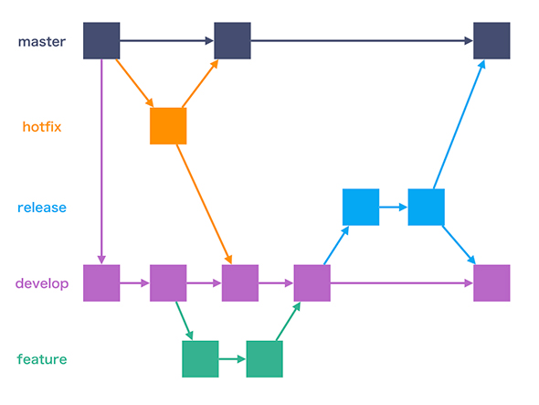

主に開発におけるブランチルールについて説明します。

## 1. Gitでの開発バージョンについて

バージョンナンバーは、以下のように設定します。  
`major`.`minor`.`patch` の形式で、各バージョンは以下のように定義します。

- `major` : メジャーバージョン ⋯ 大きな変更や破壊的変更のたびに更新される (= リリースと同時に更新される)
- `minor` : マイナーバージョン ⋯ 機能追加や変更のたびに更新される
- `patch` : パッチバージョン ⋯ バグ修正のたびに更新される

## 2. Gitのブランチ運用ルール
本開発では、Gitのブランチ運用ルールとして「Git Flow」に基づき、バージョン管理を行います。

| ブランチ名 | 説明 |
| --- | --- |
| main | 本番環境のブランチで、リリースするために使う。   ここでは直接コミットせず、マージのみ行う。 |
| develop/`version` | 開発中の主軸となるブランチ。   developからfeatureブランチを作成し、そこで作業する。   こちらも直接コミットせず、マージのみ行う。|
| feature/`version`/`issue番号`/`タスク名称` | 機能の追加や変更、不具合の修正など実際に開発を行うブランチ。   作業完了後、developにマージする。 |
| hotfix/`version`/`issue番号`/`タスク名称` | リリース後にバグが発生した場合、修正を行うブランチ。

:::note
### GitFlowとは
以下は [【Git】ブランチ運用ルール「Git-flow」と「GitHub Flow」](https://supersoftware.jp/tech/20221021/17928/) を引用

- master  
本番環境のブランチで、リリースするために使う。ここでは直接コミットせず、マージのみ行う。  
※masterブランチ上では開発を行わない。  
- develop  
開発中の主軸となるブランチ。developからfeatureブランチを作成し、そこで作業する。  
※developブランチ上では開発を行わない。  
- feature  
機能の追加や変更、不具合の修正など実際に開発を行うブランチ。作業完了後、developにマージする。  
- release  
検証環境、もしくはリリース準備用のブランチ。developから作成し、リリースに伴う細かい修正等を行う。  
作業完了後、masterブランチとdevelopブランチにマージする。  
※releaseブランチがあることで、リリース作業中にもdevelopブランチで並行して開発を進めることができる。  
- hotfix  
リリース後にバグが発生した場合、修正を行うブランチ。  
masterブランチから作成し、作業完了後、masterブランチとdevelopブランチにマージする。  
- support  
旧版のサポートをするときに用いるブランチ。オプションであり、使わないこともある。  
:::