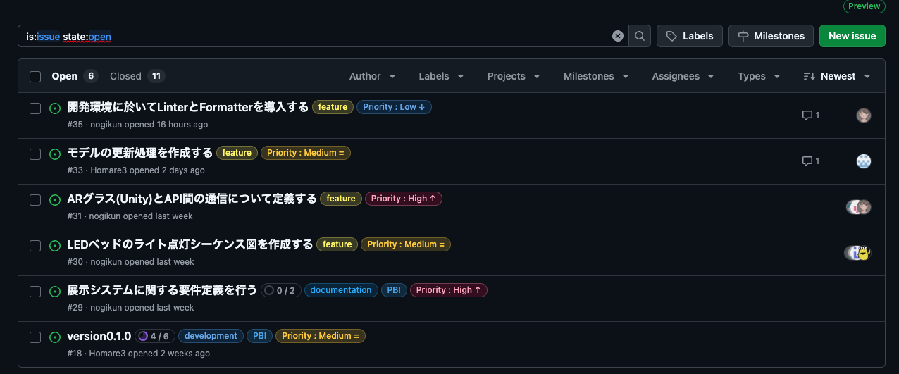
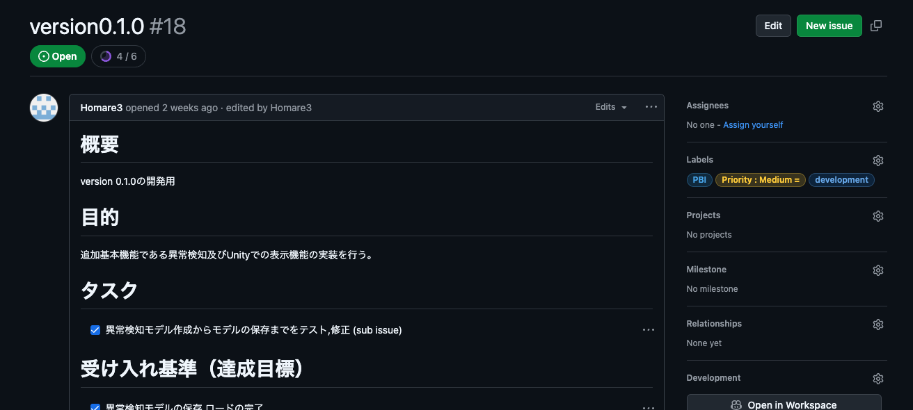
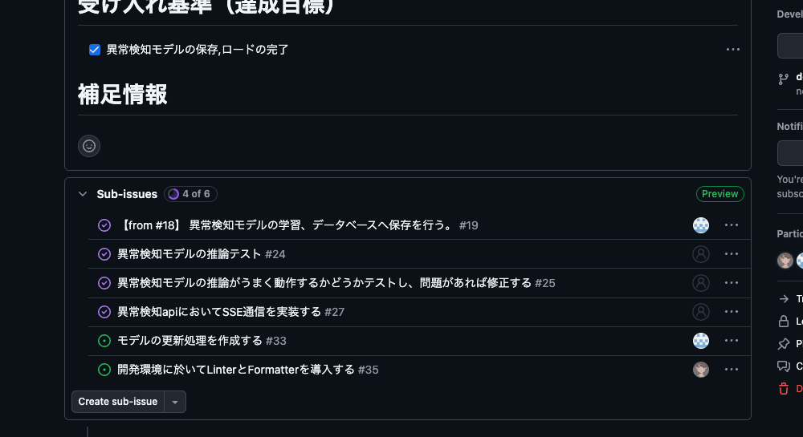
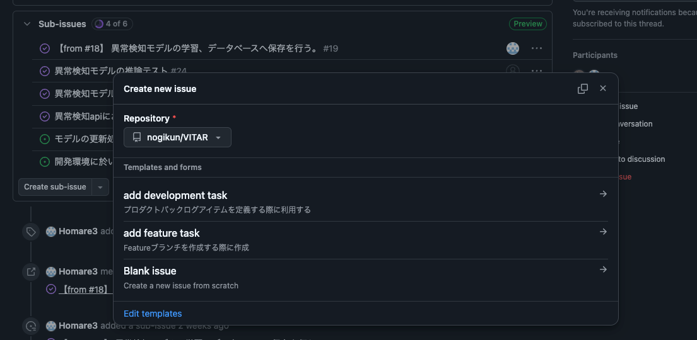
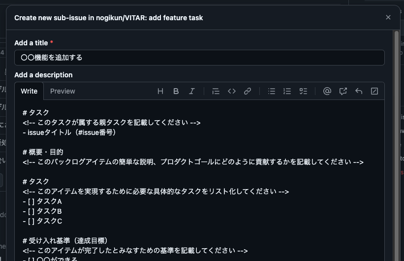
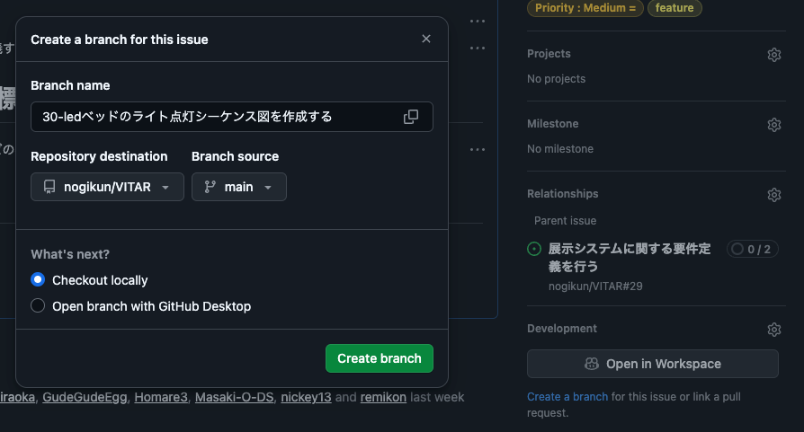
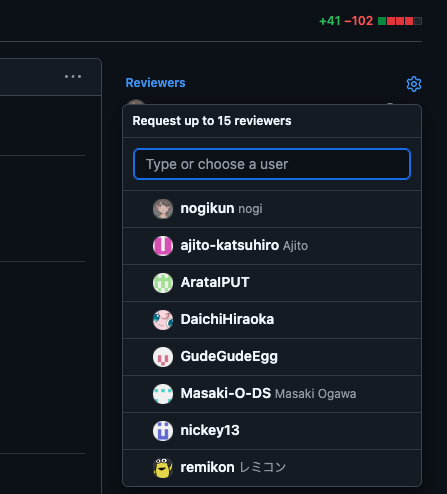
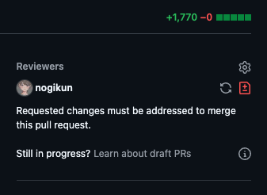

GitHubを使用したタスク管理のルールについて説明します。

## 1. 新しいタスクを設定する場合(Feature)

1. issueページに移動
    
    
    
2. ラベル `development` がついているタスク（親タスク）を確認
    
    
    
3. `Create Sub-issue` から、 `add feature task` を選択。

    
    
    
    
    

4. テンプレートに従いタスクを定義する。
    
    
     

## 2. 作業ブランチを設定する
1. 前述で作ったsub-issueページの右部に `development` という項目がある。
`Create a branch` を押下する事でポップアップが表示されるのでそこから作成するのが便利です。
※ 親ブランチには気を付けてください！

## 3. 開発作業を行う
作業を行う。（今回は割愛）

## 4. レビューをお願いする（Pull Request）
1. Pull Request タブから作業ブランチから `development/**` ブランチへプルリクエストを行ってください。
    
    ### 📌 重要なこと
    
    特に、レビュワーが動作確認を行う際に見比べながら行いたい。
    「おこなった動作確認」には、どの様な手順でテストをしてどの用な返答が帰ってきたのかを明確に記載してください。
    - ⚠️ プルリクエストページの作成後必ず、**レビュワーの指定**をお願いします。  

        
        

## 5. 再レビューの申請
1. 修正を適応した後レビューを再度お願いする
    
    レビュワーに「🔄」 アイコン押下で、再度レビューをお願いできる。
    
    **Commitするだけでは通知が送信されないので注意！**
    
    
