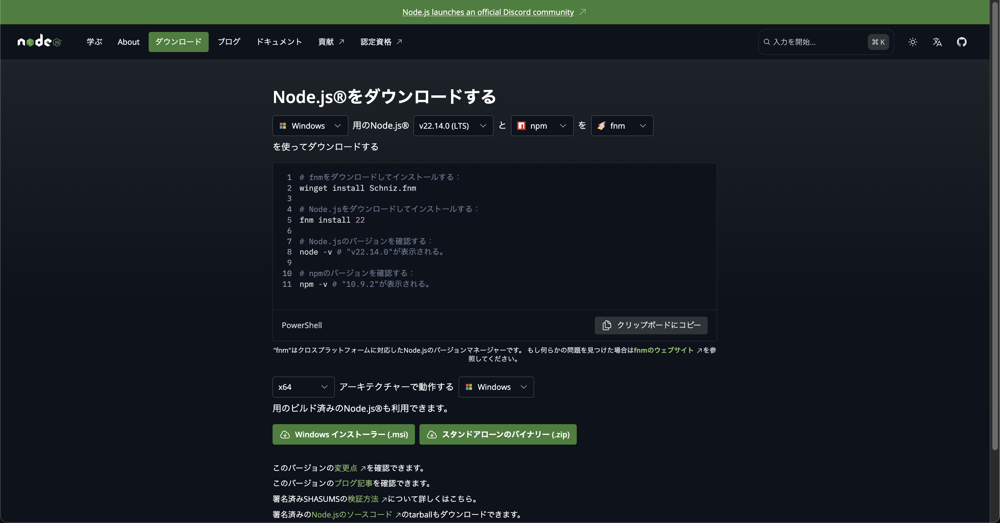
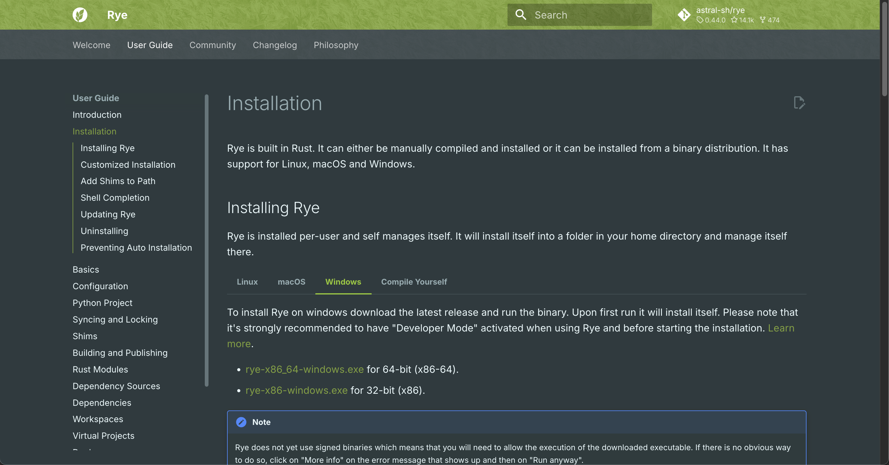

ここでは、開発に必要な環境の構築方法について説明します。
## 0. 前提条件
- Gitがインストール済みである事  
（インストール済み出ない場合は [GitHubの設定について](https://gamification-for-factory.netlify.app/docs/note/setting-github) を参照してください。）
- Pythonがインストール済みである事


## 1. 📥 レポジトリをクローンする
以下のコマンドより、プロジェクトをクローンしてください。

```bash
git clone https://github.com/nogikun/Gamification-for-factory.git
```

## 2. 🐳 DockerDesktopのインストール
Docker, Docker Compose を利用するために、DockerDesktopをインストールしてください。

- [Windows 11にDocker Desktopを入れる手順](https://qiita.com/zembutsu/items/a98f6f25ef47c04893b3)

インストールが終了したら、新しくターミナルを開いて以下のコマンドを実行し、Dockerが正常にインストールされているか確認してください。

```bash
docker --version
```
```bash
docker-compose --version
```

## 3. 📦 Node.jsのインストール
フロントエンド開発に利用するNode.jsというアプリケーションをインストールしてください。
- [Node.jsのインストール](https://nodejs.org/ja/download/) から下図のようなページにアクセスする事ができます。  
    LTS版を選択し、それぞれのOSに合ったインストーラーをダウンロードしてください。  
    ※ 細かな説明は [こちらの記事「Node.jsをインストールする」](https://qiita.com/sefoo0104/items/0653c935ea4a4db9dc2b) を参照してください。

    

## 4. 🌾 Ryeのインストール
Pythonのパッケージ管理ツールとしてRyeを利用します。インストールしてください。  

:::note
Ryeは、Pythonのパッケージ管理だけでなく、Pythonのバージョン管理や、ライブラリの高速インストール、仮想環境の管理なども行えるツールです。
:::

※ 利用方法は [こちらの記事「Pythonライブラリ管理ツール決定版！Ryeを導入してみた」](https://zenn.dev/ncdc/articles/1979def94dedea) を参照してください。

- [Ryeのインストール](https://rye.astral.sh/guide/installation/) から下図のようなページにアクセスする事ができます。 

    


### Windowsの場合
上記の画面内、 `rye-x86_64-windows.exe` をクリックしてダウンロードしてください。  
ダウンロードしたファイルを実行し、インストールしてください。  
※ 詳しい手順は [こちらの記事「Ryeとは？【概要・環境構築・使い方】」](https://zenn.dev/umi_mori/books/python-programming/viewer/introduction-to-rye#%E3%82%A4%E3%83%B3%E3%82%B9%E3%83%88%E3%83%BC%E3%83%AB%E3%81%AE%E6%96%B9%E6%B3%95) を参照してください。

### macOSの場合
以下のコマンドを実行してください。めっちゃ早いです。
```bash
brew install rye
```

{/* ## 3. 📦 必要なパッケージをインストールする（単体テスト用）
以下のコマンドを実行して、必要なパッケージをインストールしてください。 */}


{/* ## 2. 🪧 pre-commitの設定
`pre-commit` をインストールする方法は下記の通りです。

### pre-commitのインストール
#### ● linux・macOSの場合
brewがインストールされている状態で以下のコマンドを実行してください。
```bash
brew install pre-commit
```

:::note
`brew` がインストールされていない場合は、[こちら](https://brew.sh/ja/) からインストールしてください。  
Homebrew：https://brew.sh/ja/
:::

#### ● Windowsの場合
※ macOSでも以下のコードは実行可能です。
```bash
pip install pre-commit
```

### pre-commitの適用
プロジェクトのルートディレクトリに移動し、以下のコマンドを実行してください。
```bash
pre-commit install
```

### pre-commitの設定変更
`pre-commit` の設定を変更する場合は、`/.pre-commit-config.yaml` を編集してください。  
設定の詳細については、[こちら(https://pre-commit.com/)](https://pre-commit.com/) を参照してください。  
編集後は、以下のコマンドを実行してください。
```bash
pre-commit clean
pre-commit install
``` */}
